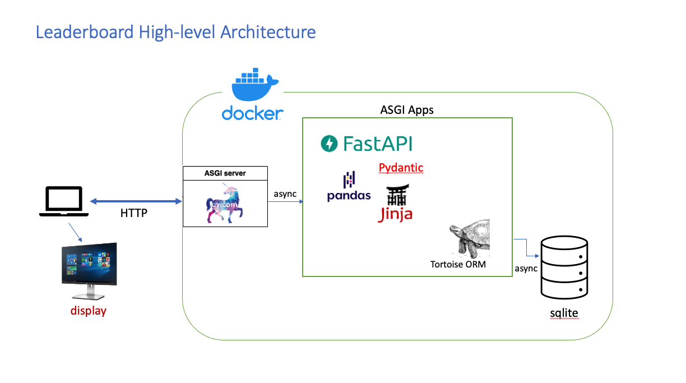

# Leaderboard Display
#
## Author - David Nguyen (davidn@cisco.com)
# 
### Description
This is a simple leaderboard display application, for presenting a user leaderboard of data. 
The python app provides a simple way of capturing and displaying of 'at event' challenge data.

This package can be dockerized and run anywhere docker is available.

 

### Appication has been tested on Python 3.8.9 and utilized the following modules:
1. FastAPI - FastAPI framework, high performance, easy to learn, fast to code
2. uvicorn - a Python Web Server Gateway Interface HTTP server supports async requests
2. pydantic - Data modeling, validation
3. jinja2 - HTML template page rendering
4. tortoise ORM - an easy-to-use asyncio ORM (Object Relational Mapper) inspired by Django. 
5. pandas - is a fast, powerful, flexible and easy to use open source data analysis and manipulation tool

### How to run this app:
1. Activate your python virtualenv
2. pip install -r requirements.txt  # To install all required modules
3. uvicorn leader:app --reload  # this will start the web server to listen to your request
4. http://127.0.0.1:8000/docs   # To start Swagger UI, you can input user data using POST method
5. http://127.0.0.1:8000/leaders # To display leader

This simple app suggests a good framework for developing any web application/services quickly so
I hope you will find it useful. Have fun!
